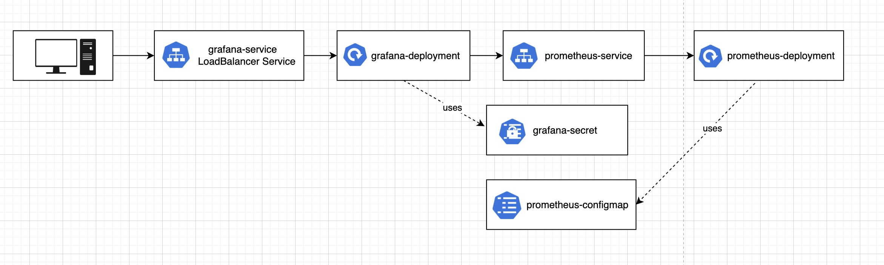

# Prometeus / Grafana kubernetes cluster example
These resources will be created:
* Grafana Deployment
* Grafana external Service
* Prometheus Deployment
* Prometheus Internal Service
* Secret for Grafana
* Configmap for Prometheus

Deploy this application to Minikube or any other cluster:
```
kubectl apply -f .

```

Minikube proxy
```
minikube service nodejs-app-service --url
```


UML diagram of architecrure

